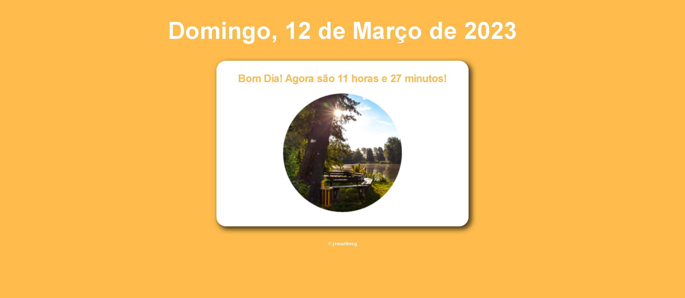
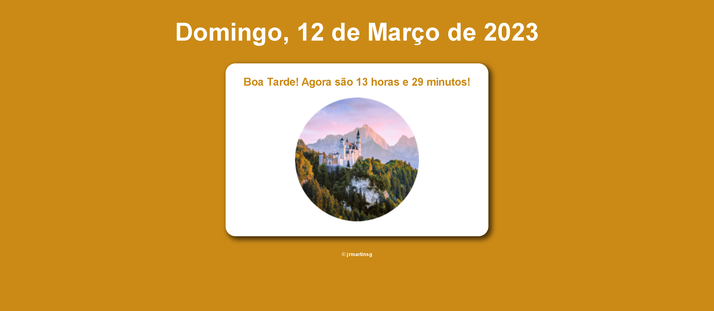
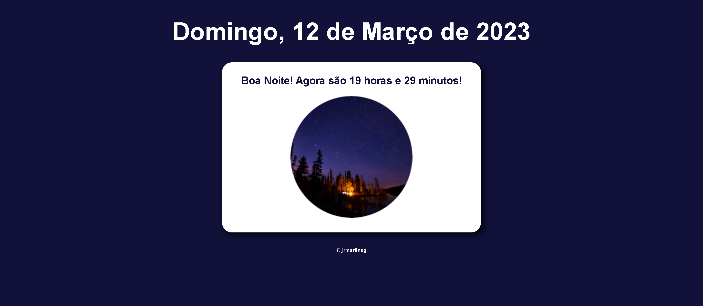
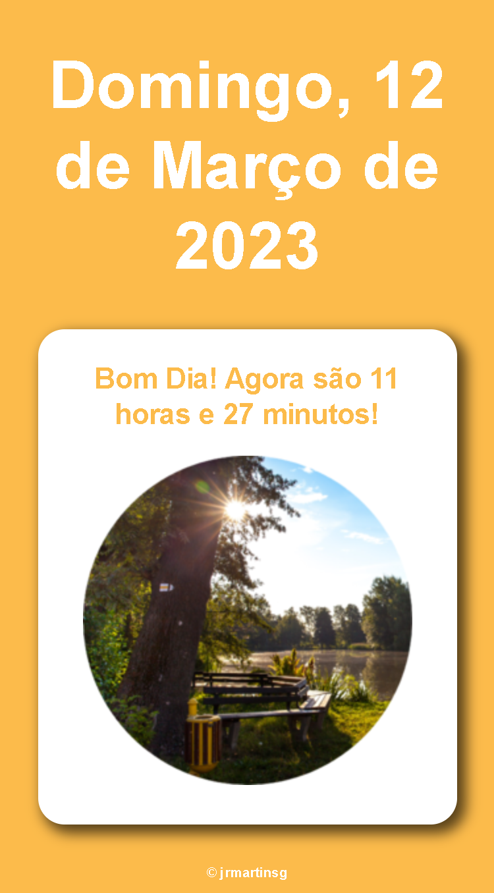
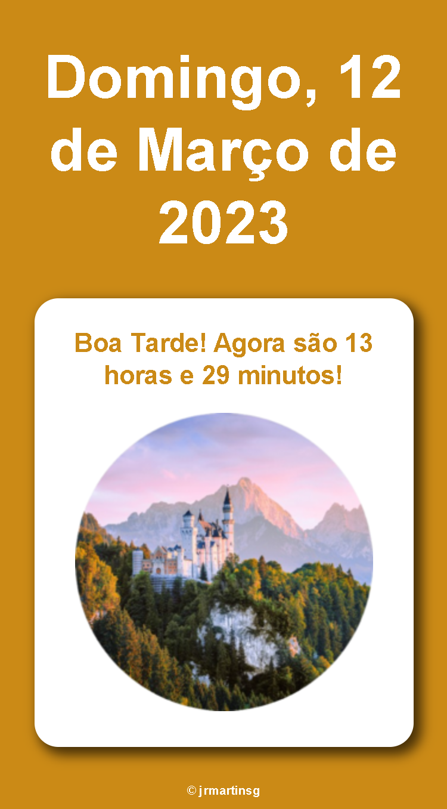
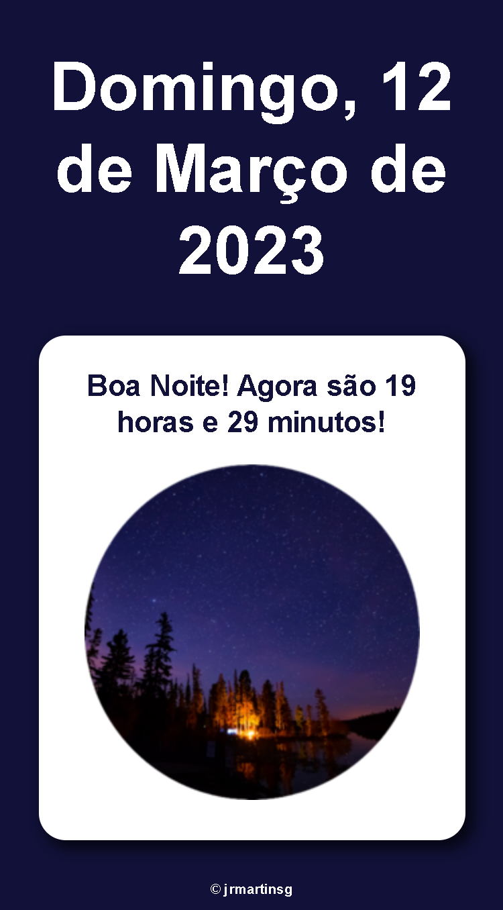

<h1>Saudações</h1>

Projeto com base em uma vídeo-aula do Curso Em Vídeo.  
    Peguei todo o conceito da aula, coloquei meus gostos pessoais e pude colocar em prática meus conhecimentos em JavaScript!
Conforme o horário do dia e dia da semana vai retornar uma imagem, horário e saudação diferente!

<nav>
    <a href="#desktop">Desktop</a>
    <a href="#mobile">Mobile</a>
    <a href="https://hoje-e-que-dia.vercel.app/" target="_blank">Projeto</a>
    <a href="#tecnologias">Tecnologias</a>
</nav>

<h2 id="desktop">Desktop - Dia</h2>

<h2>Desktop - Tarde</h2>

<h2>Desktop - Noite</h2>

<h2 id="mobile">Mobile - Dia</h2>

<h2>Mobile - Tarde</h2>

<h2>Mobile - Noite</h2>

<a href="https://hoje-e-que-dia.vercel.app/" target="_blank"><button>Ver Projeto</button></a>

<h2 id="tecnologias">Tecnologias</h2>
<ul>
    <li>HTML5</li>
    <li>CSS3</li>
    <li>JavaScript</li>
</ul>

<h4>
    Feito por <a href="https://www.linkedin.com/in/jrmartinsg/" target="_blank">jrmartinsg</a>
</h4>